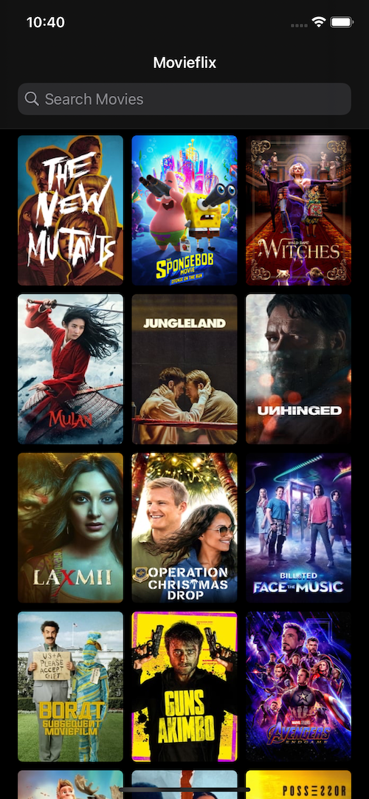

#  Movieflix

 

  

  

  

  

  

  

Projeto criado com o intuito de aperfeiçoar as habilidades em:
- API Rest
- Testes Unitários
- MVVM
- Coordinator

### O que é?
- Aplicativo que exibe uma série de filmes provenientes da API do [The Movie Database (TMDb)](https://www.themoviedb.org).

### Requisitos
- Xcode 12+
- Cocoa Pods
- [Key](https://developers.themoviedb.org/3/getting-started/introduction) no site 
[The Movie Database (TMDb)](https://www.themoviedb.org) para poder ter acesso aos dados da API

### Créditos
- Todas as informações exibidas nesse aplicativo são provenientes de uma API disponibilizada pelo site [The Movie Database (TMDb)](https://developers.themoviedb.org/3/getting-started/introduction).
